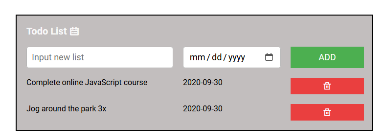
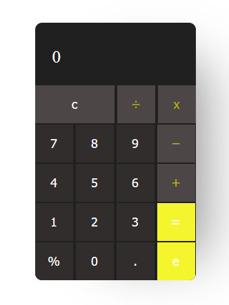
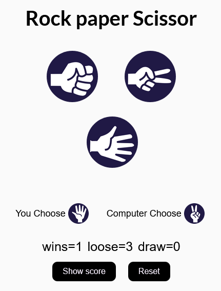

# Basic javaScript Projects

<h1>
  PROJECT LIST: 
</h1>

<ul>
  <li>TODO LIST</li>
  <li>
    CALCULATOR
  </li>
<li>Rock Paper Scissor Game</li>
</ul>

  <h2>Todo List</h2>
  
Sample

  

  <h2>Calculator</h2>
  
Sample

  

  <h2>Rock Paper Scissor Game</h2>
  
Sample

  

  

  
